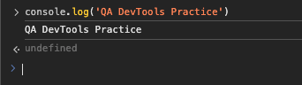
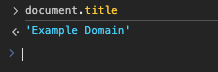
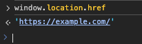
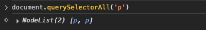

# DevTools Practice Log

- Website used: example.com

## Command 1:

- `console.log('QA DevTools Practice');`

**RESULT:** The text shows in console: `QA DevTools Practice`
How this might help in testing:

- It is useful for printing messages while testing for easier debuging.

**_SCREENSHOT:_**

## Command 2:

- `document.title`

**RESULT:** The command shows the page title: `Example Domain`
How this might help in testing:

- Useful for verifying the current page title

**Screenshot:**

## Command 3:

- `window.location.href`

**RESULT:** The command shows the current URL: `https://example.com/`
How this might help in testing:

- Helps validate the current URL after navigation

**Screenshot:**

## Command 4:

- `document.querySelectorAll('p')`

**RESULT:** The command shows all paragraph elements
How this might help in testing:

- Useful for checking if paragraph elements are present

**Screenshot:**

